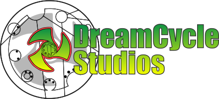
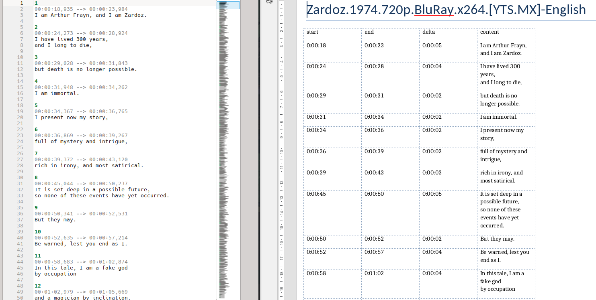

<!-- PROJECT LOGO -->
 

  
  

  <h3 align="center">srt2docx</h3>

Convert srt files to tables in docx

This assumes you have a bash environment.

### Installation
- Run `make setup`, to initialise environment and create the vitual python environment
- Source the init script `source source-me`, to activate the python environment

### Running
- Copy `srt2docx_settings_example.yaml` to `srt2docx_settings.yaml` and add your preferences.
- Go to directory with input files.
- execute the script `srt2docx` with the full path, or if you source the `source-me` file it will get added to your path and you can just use `srt2docx` without the path.

### Watermarks
If you want to use or change the watermark, put the file in the assets directory, and put the file name in the yaml.
The script will look in the assets directory for all images.

After a sucessful run you should have docx files that share the same base name with the input files except with a `.docx` extension. Errors should be reported to std out.

>Any questions or comments [Scott Dillman](mailto:scott@bitwise.ninja)

Licensed under MIT.